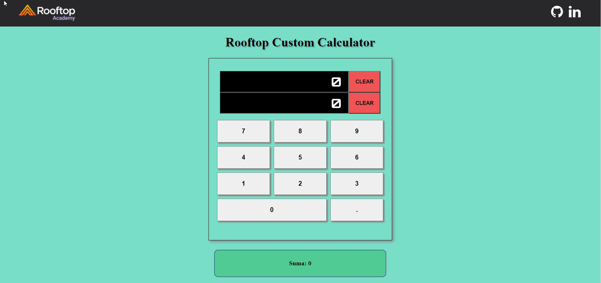
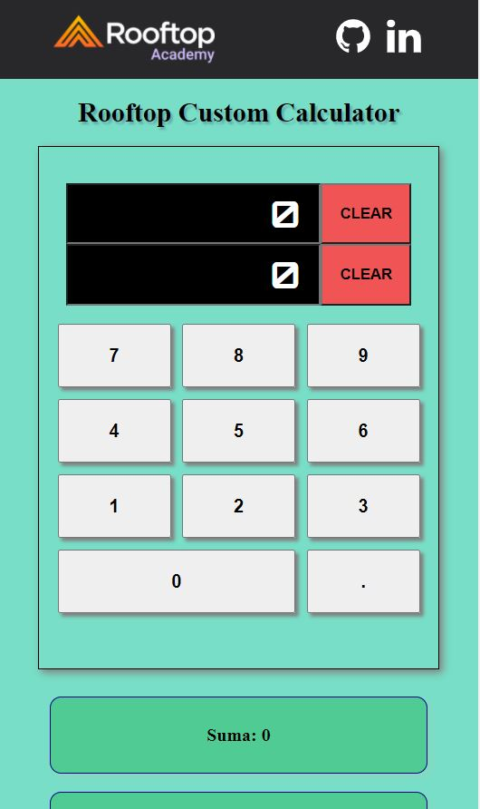

   <h1 align="center">Custom Calculator - Rooftop Academy</h1>
   

  
## The objetive

Your objetive is to build a custom calculator with two inputs, by default both must have value 0.

Optional: Create a numeric keyboard.

You should only be able to write numbers.

In each input there is a button that says "clear", when clicked on it the value should return to 0.

Below it should automatically show all the calculations - addition, subtraction, multiplication, division, power, square root and the hypotenuse

## Desktop Design

  

## Mobile Design

  

## Demo
[https://rooftop-custom-calculator.netlify.app/](https://rooftop-custom-calculator.netlify.app/)

## Project
### Tools

- React.js
- Vite js
- CSS
- React-Beautiful-DND

### Project Structure
The files are structured as follow:

    .
    ├── docs
    ├── public               # Static Files
    ├── src
        ├── components  
        App.css
        App.tsx
        index.tsx
    └── README.md            # The first page that the user will view when will visit the repository.

## Requirements
* npm or yarn
* Git

## Local deployment

* Clone repository.
* Execute the command `npm install`
* Execute the command `npm run serve`

## Documentation:

For the drag and drop I used the examples provided in the official repository of react-beautiful-dnd

[https://codesandbox.io/s/k260nyxq9v](https://codesandbox.io/s/k260nyxq9v)
